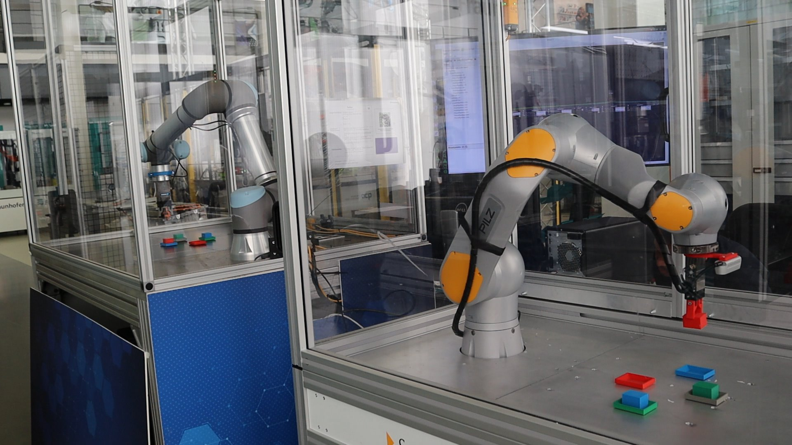

# MANIPULATION USE CASES  

The use cases for the manipulation area have been developed using two different types of Robots, the UR5e from Universal Robots and the Pilz PRBT. For both cases exists a driver written in ROS 2 to command new positions and get data from the encoders.

*Figure 1: Real robot on the laboratory experiments hall.*

*Figure 2: UR5e and PRBT RVIZ visualization.*

The auto-generated code which run on the real robots is available under: [RosToolingUserStoryImplementation](https://github.com/David-its-me/RosToolingUserStoryImplementation)

## Overview of Implemented User Stories for the Manipulation Case

| **ID**       | **User Story**                                         |
|--------------|-------------------------------------------------------|
| **MANI-01**  | Sample movements                                      |

### Description
A company wants to demonstrate its expertise at its trade fair stand where a robotic arm should perform simple pick-and-place movement sequences in a repetitive cycle. There is not much time left for preparation, so they want to have the robot arm operational as quickly as possible.

- **Difficulty:** Simple  

---

| **ID**       | **User Story**                                         |
|--------------|-------------------------------------------------------|
| **MANI-02**  | QR detection and decision methodology of a picking robot |

### Description
In this scenario, a robotic arm is integrated into a production line, where smaller packets on a conveyor belt drive by. Currently, the robot is responsible for picking and sorting out packets with a specific color from the conveyor belt.  
Now, there is a need for more fine-grained differentiation regarding which packets should be sorted out. The technical director decided to use labels with QR codes instead of packet colors. The currently deployed software includes a module for decision-making about packets to be sorted out.  
This part of the software must be reimplemented. An algorithm is needed to detect and read QR codes. Based on the information from the QR code, another module will decide if the packet should be picked.

- **Difficulty:** Medium  

---

| **ID**       | **User Story**                                         |
|--------------|-------------------------------------------------------|
| **MANI-03**  | Pick and place ball                                   |

### Description
A toy manufacturer wants a packing robot capable of packing objects into cardboard boxes. Specifically, the manipulator should pick up a ball and place it into a carton box.  
The surrounding environment is very static, meaning there are no people or moving objects around the robot. Both the ball and the box are consistent in size and position, so the robot requires little to no perception of its surroundings.

- **Difficulty:** Simple  

---

| **ID**       | **User Story**                                         |
|--------------|-------------------------------------------------------|
| **MANI-04**  | Pick box from shelf with GUI                          |

### Description
A pharmacy shop wants to build a system that can automatically pick drug packages from a small warehouse within the shop. Currently, the medicine boxes are picked manually by the staff.  
A configurable robot should be able to perceive, pick, and place small boxes. Additionally, a simple GUI will be installed at the counter to request medicine, which the system will then retrieve.

- **Difficulty:** Complex  

## Graphical representation

Graphically the systems, thanks to the MDD proposed solution, can be shown as:

*Figure 1: Simplified view of the MANI-02 implementation using the RosTooling.*

