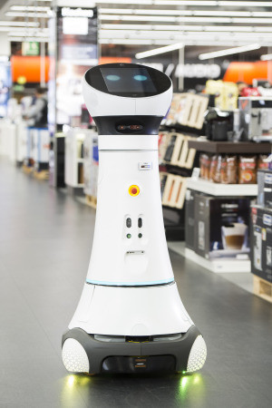
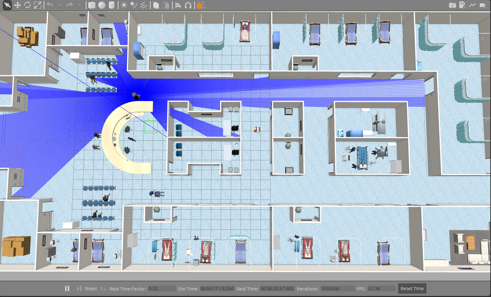
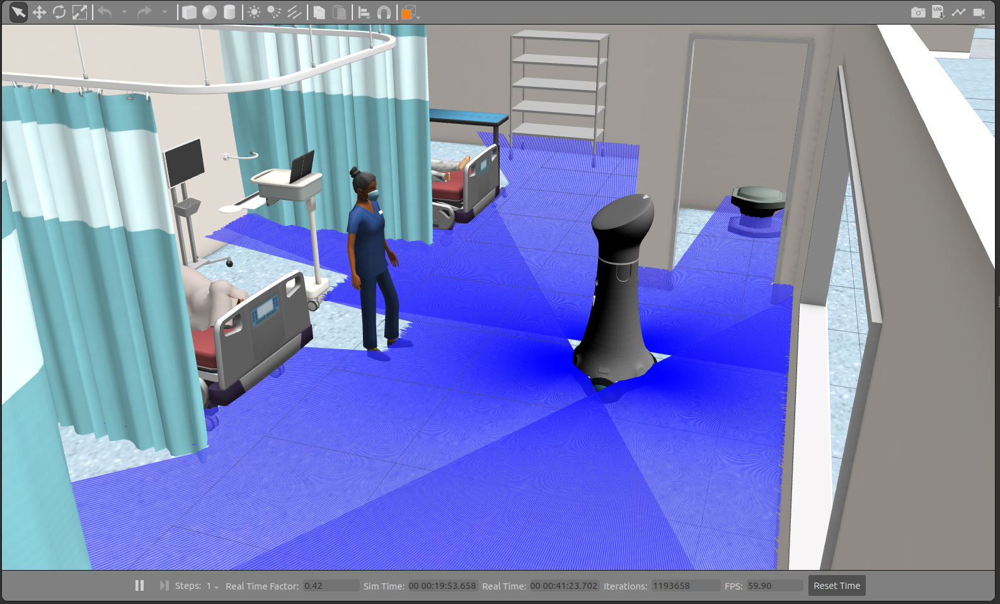
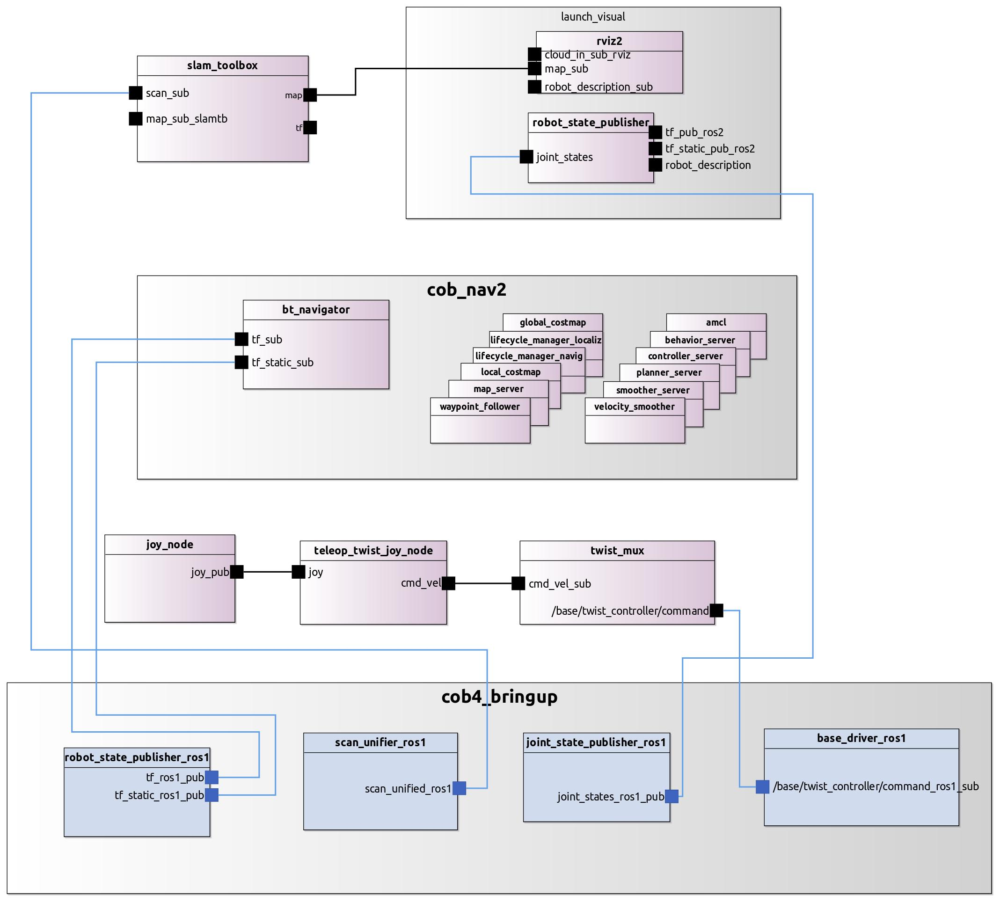

# MOBILE ASSISTANT ROBOT USE CASES

The use cases for the mobile assistant robot were implemented using the Care-O-bot robot, specifically the cob4-25 model from the series. While the robot itself operates on a ROS 1 implementation, we developed a simulation environment entirely in ROS 2 to demonstrate the advantages of the proposed MDD approach in both scenarios. For the real robot, we utilized RosTooling to develop a hybrid system integrating both ROS 1 and ROS 2.

*Figure 1: Cob4-25 performing a real scenario on a open public space.*

*Figure 2: Cob4-25 on the simulation environment.*

The auto-generated code which run on the real robot and the simulation environment is available under: [RosToolingUserStoryImplementation](https://github.com/ipa-ych/cob_eclipse_workspace)

## Overview of Implemented User Stories for the Mobile Assistant Robot Case

| **ID**       | **User Story**                                         |
|--------------|-------------------------------------------------------|
| **MOBI-01**  | Dummy mobile robot under remote control                |

### Description
In the hospital pharmacy, one of the duties of the pharmacy staff is to transport boxes of medication from the unloading area to the storage room every workday. Typically, staff use hand trucks to move the boxes through narrow corridors to the pharmacy.  
Now, the pharmacy manager plans to introduce a fleet of mobile transport robots. The staff will be able to remotely control the robots using a simple joystick to transport the boxes to the storage room. The active safety functions (hardware safety) will still be enabled to ensure the safety of the robot and the public during operation.

- **Difficulty:** Simple  
- **Environment:** Real robot and simulation

---

| **ID**       | **User Story**                                         |
|--------------|-------------------------------------------------------|
| **MOBI-02**  | Mobile robot for mapping the environment and self-navigation |

### Description
A European Caring Center for senior citizens purchased a Care-O-Bot for caring utilities. The robot is expected to help caretakers to transport food, medical supplies, or groceries inside the caring center, from room to room.  
As the robot is brought to a new environment, it needs to generate a map of the interior area of the caring center first. After the map is generated, the robot is expected to navigate itself to a given destination (either hard-coded or received from a caretaker through a GUI). Since the caring center is populated with patients and workers, it is important for Care-O-Bot to avoid any collision with moving objects and provide sound and light notifications to the environment.

- **Difficulty:** Medium  
- **Environment:** Real robot and simulation

---

| **ID**       | **User Story**                                         |
|--------------|-------------------------------------------------------|
| **MOBI-03**  | Robot assistant for autonomous delivery in hospital    |

### Description
A study pointed out that in the United States [KCD00], the number of patients who die in hospitals due to receiving incorrect medication exceeds the number of deaths caused by motor vehicle accidents.  
Looking to keep all staff in the pharmacy operating at the top of their licensure, a hospital purchased a fleet of service robot assistants to deliver medicine and medical materials between the pharmacy, office area, and inpatient ward.  
The robot is expected to navigate itself through busy rooms and corridors to make its way to the pharmacy, where pharmacy staff load the carrier plate with medicine. After detecting the medicine has been successfully loaded, the robot will navigate itself back to its starting point. Various interaction methods are combined to achieve smooth cooperation with human staff. The robot is expected to display its working status to pedestrians through audio, visual, and mimic signals, and inform the staff whenever external help or human intervention is needed.

- **Difficulty:** Complex  
- **Environment:** Real robot and simulation

## Graphical representation

Graphically the systems, thanks to the MDD proposed solution, can be shown as:

*Figure 1: Simplified view of the MOBI-02 story implementation using the RosTooling.*
