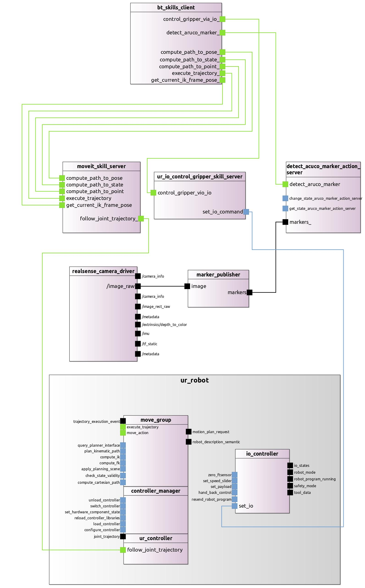

## MDD EVALUATION STUDY

This repository collects data from the study we drive to evaluate the advantages of using Model-Driven Developemnt (MDD) techniques for the integration of robotics system based on ROS. For our case we used as MDD solution technology the RosTooling(*), which directly target the ROS ecosystem.

To cover all the aspects of an evaluation we opted for the combination of a quantitative with a qualitative evaluation.

### Quantitative Study

RosTooling proposes a solution for developing robotic applications using model-driven development (MDD). The case of RosTooling is particularly interesting in the sense that it leverages the advantages of the ROS ecosystem, which has an extensive catalog of hand-crafted open-source components. 
In order to make use of this catalog, RosTooling offers static code analyzer solutions as well as introspection of running systems. In this way RosTooling positions itself as an optimal tool for system integration using as composition modules existing ROS packages that can be easily imported into the RosTooling user interface.

All the documentation about how to use the RosTooling is publicly available under [RosTooling documentation](https://ipa320.github.io/RosTooling.github.io/). Based on this set of instructions, we conducted real world experiments based on two applications areas manipulation and service robots. For each of the areas a set of use cases has been proposed, this repository holds the development of these cases using the RosTooling:
- [Manipulation](Quantitative/Manipulation/README.md)
- [Mobile Assistand Robot](Quantitative/Mobile_Assistant_robot/README.md)

Graphically the systems, thanks to the MDD proposed solution, are shows as:

*Figure 1: Simplified view of a manipulation case using the RosTooling.*

*Figure 2: Simplified view of a mobile assistant robot case using the RosTooling.*

To conduct this study, the publicly available work from the following repositories has been utilized:
- RosTooling source code: [RosTooling](https://github.com/ipa320/RosTooling)
- ROS2 embedded code generator: [rossdl](https://github.com/CoreSenseEU/rossdl)
- Python parsers (packed as a ROS package) for the ROS and ROSsystem models: [ros_model_parser](https://github.com/ipa320/ros_model_parser)
- Python implementation for the static code analyzers and docker containers setups for different ROS distros: [ros-model-extractors](https://github.com/ipa320/ros-model-extractors)
- Runtime monitoring pipelines:
  - ROS1: [rosgraph_monitor](https://github.com/ipa320/rosgraph_monitor)
  - ROS2: [ros2model](https://github.com/ipa-cmh/ros2model/)
- Eclipse update site: [RosTooling-update-site](https://github.com/ipa320/RosTooling-update-site)

### Quantitative Study

For the qualitative evaluation of the proposed MDD solution against conventional robotics software development, a questionnaire has been made available to users. This survey evaluates the ease of use, usability and potential future use of the proposed solution. All the [questions](Qualitative/README.md) are available.

## Related publications

(*)For more information about the RosTooling we recommend the review of the following scientific work:
- Paper: Bootstrapping MDE Development from ROS Manual Code - Part 1: Metamodeling [IRC19 paper](https://ieeexplore.ieee.org/document/8675668)
- Paper: Bootstrapping MDE Development from ROS Manual Code - Part 2: Model Generation [Models paper](https://ieeexplore.ieee.org/document/8906937)
- Journal Paper: Bootstrapping MDE development from ROS manual code - Part 2: Model generation and leveraging models at runtime and  [SoSym paper](https://link.springer.com/article/10.1007/s10270-021-00873-2)
- Paper: Lifting ROS to Model-Driven Development: Lessons Learned from a bottom-up approach [RoSE paper](https://awortmann.github.io/downloads/preprints/2023/Lifting_ROS_to_Model-Driven_Development_-_Lessons_Learned_from_a_bottom-up_approach.pdf)
